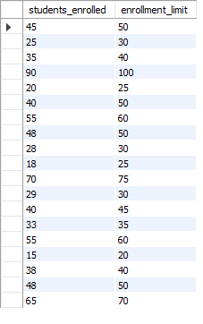
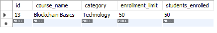

# Finals Lab Task 3-1. Using MYSQL Clause
In this task, it involves setting up the database environment, retrieving targeted information based on certain conditions, organizing data into logical categories, and summarizing key figures. This reinforces the ability to extract insights from data and understand how database systems are used to support decision-making processes.

Following the directions given below in creating the given database.
1. Create a database named online_courseDB
2. Use the online_courseDB
3. Copy and paste the initial query then perform the SELECT statements required for each
problems in the figure then the download onlineCourse.sql file.

Item description:

The following are already implemented:

A table named courses with the following fields:

id: Unique Integer, auto-increment, primary key.

course_name: String (VARCHAR), not null.

category: String (VARCHAR), not null.

enrollment_limit: Integer, not null,

students_enrolled: Integer, not null.

20 courses are already present.

## Query Statements:
- **Step 1.**  Retrieve all courses where students_enrolled is less than the enrollment_limit.    
- **Step 2.**  Group courses by category and calculate the total number of students enrolled for each category. 
- **Step 3.**  Retrieve the courses that are fully enrolled (ie,, students enrolled equals enrollment limit).    
- **Step 4.**  Calculate the total number of students enrolled across all courses.   
- **Step 5.**  Sort courses by students_enrolled in ascending order.  
  

## Table Structures:
- **Table 1.** students_enrolled is less than the enrollment_limit.    
    
- **Table 2.** orgranized grouped courses by category.  
    
- **Table 3.** retrieved courses that are fully enrolled.  
    
- **Table 4.** calculated total of the students.  
      
- **Table 5.** sorted courses.  
    

